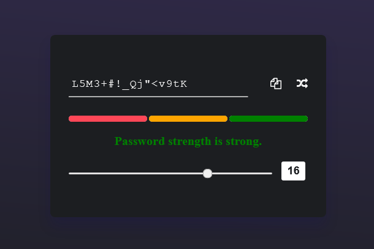

# Random Password Generator with Indicator

This is a simple password generator using js.
Generated password is categorized into three part i.e weak, medium and strong with the help of regular expression.

- Regex for Weak password is : 
    ```
    /(?=.*[a-z])[a-z]/;
    ```
- Regex for Medium password is :
    ```
    /(?=.*[a-z])(?=.*[0-9].*[0-9])(?=.*[A-Z].*[A-Z])[a-zA-Z0-9]/
    ```
- Regex for Strong password is :
    ```
    /(?=.*[a-z])(?=.*[0-9].*[0-9])(?=.*[A-Z].*[A-Z])(?=.*[!@#$%^&*{}.:;?/|"()<>].*[!@#$%^&*{}.:;?/|"()<>])[a-zA-Z0-9!@#$%^&*{}.:;?/|"()<>]/
    ```  

## [Goto live](https://shankarlmc.github.io/password-generator-js/ "Generate Password" )

### Password Strong Indicator



Enjoy ✌
